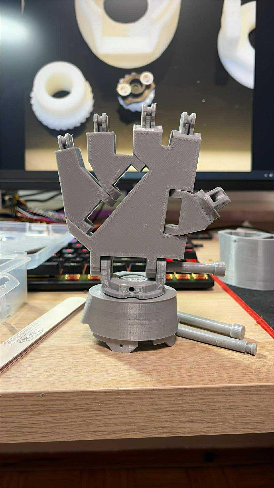

# 🤖 Autonomiczne Ramię Robota (Python + LabVIEW na Raspberry Pi)

Ten projekt to w pełni funkcjonalne ramię robota sterowane za pomocą gestów/ruchu przechwytywanego przez kamerę w czasie rzeczywistym. Cały system został zaprojektowany jako **urządzenie bezobsługowe (standalone)** działające na komputerze Raspberry Pi, łącząc wysokopoziomową analizę obrazu z autorskim, niskopoziomowym sterowaniem sprzętem.

## ✨ Główne cechy projektu

* **🍓 W pełni autonomiczne (Standalone):** Całość oprogramowania (skrypty Python oraz silnik LabVIEW) została wdrożona na Raspberry Pi. Projekt działa bezobsługowo – po prostu podłączasz zasilanie, a system wstaje i jest gotowy do pracy.
* **👀 Sterowanie wizyjne (Python):** Skrypt działający w tle na malince obsługuje kamerę, śledzi ruch i tłumaczy go na polecenia przestrzenne.
* **⚙️ Autorski silnik i sterowniki (LabVIEW):** Główna logika oraz **napisane od zera sterowniki do płytki PCA** działają natywnie na Raspberry Pi. Zapewnia to stabilną kontrolę nad sprzętem (magistrala I2C) bez polegania na zewnętrznych, gotowych bibliotekach wysokiego poziomu.
* **🔗 Płynna wymiana danych:** Zoptymalizowana komunikacja wewnątrz Raspberry Pi pomiędzy procesem wizyjnym (Python) a procesem sterującym (LabVIEW).

---

## 📸 Historia budowy (Galeria)

Projekt ewoluował od prototypu do finalnego, autonomicznego urządzenia. 

  
  
  

---

## 🛠️ Architektura Sprzętowa i Systemowa

Sercem układu jest **Raspberry Pi**, które pełni rolę jednostki centralnej dla całego systemu:

1. **Kamera na USB/CSI** stale rejestruje obraz i przekazuje go do malinki.
2. **Skrypt Python** działający jako usługa w tle analizuje klatki i wykrywa pozycję docelową.
3. Dane są przesyłane lokalnie do **aplikacji LabVIEW** (wdrożonej na Raspberry Pi, np. za pomocą LINX).
4. **Program LabVIEW** przelicza kinematykę odwrotną i za pomocą autorskiego sterownika wysyła komendy bezpośrednio po szynie **I2C** do **płytki kontrolera PCA**.
5. Płytka PCA sprzętowo generuje sygnały PWM sterujące poszczególnymi serwomechanizmami ramienia.

---
